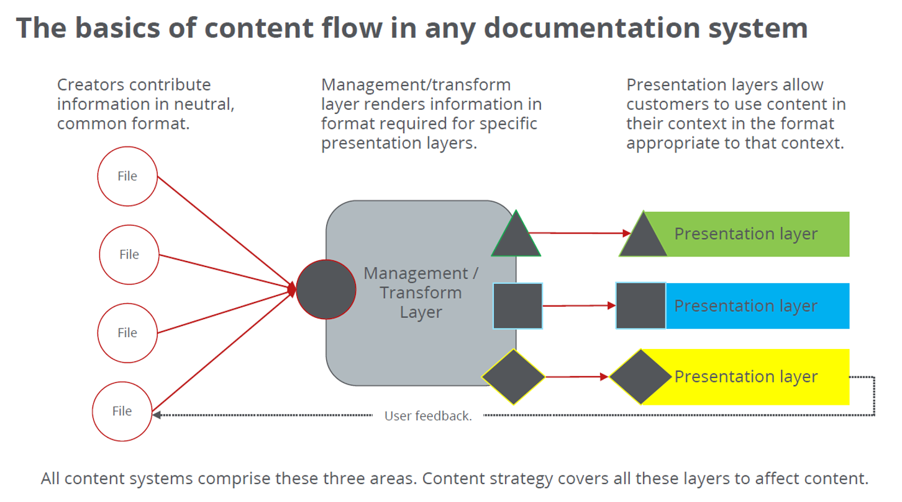

.. _content-lifecycle:

Documentation Content Lifecycle
===================================

All documentation content fits within one or more phases in a content lifecycle. Information is time-bound and highly contextual, so a content strategy should address all of the phases of the content lifecycle. At the highest level, those phases are creating, distributing, updating or correcting, removing, and archiving or recovering content; however, the content lifecycle impacts the fundamental content layers: creation, transformation, and presentation.

Individual writers always perform the tasks in the system at some levels but might not recognize it as an integrated system.

===================================
Creation Layer
===================================

This layer is where writers/creators work with SMEs, use their own experience and skills, use specific product or domain knowledge to create content, but probably rely on others to prepare and publish the content.

===================================
Management/Transformation Layer
===================================

This layers is where content creators send content in various formats to a set of tools/technologies created or maintained by others to be transformed/prepared/readied for final distribution. The content is only readied, it has not been distributed yet, so this include merging the intermediate formats (RST, markdown, DITA, text files, image sources) with the requirements needed for the various tools. 

Typically an engineer or engineering team maintains, updates, and improves the tool(s) independent of the content creation or presentation layers; however, both the layer inputs and outputs are essential considerations and constraints for how the layer is selected, designed, or updated.

===================================
Presentation Layer
===================================

The presentation layer is a generic way of describing all the destinations where the content is distributed to be used by customers/developers. They can include omni-channels flows, which typical includes differing formats, like PDFs, HTML collections, binary downloadable content, GitHub pages, GitHub, readmes, man pages, references and more. Each distribution channel in the presentation layer has specific requirements and should exist to meet specific user/developer needs to be distributed in that format. The various destinations should have a visual design that coincides user-defined value for that format. 
