Task Analysis
====================================

Technical writers often analyze tasks to plan work or identify content gaps in existing documentation; however, most technical writers that I have worked with do not always perform the analysis in a structure manner. Any technical writer can benefit by borrowing the project management tool of a **Work Breakdown Structure (WBS)** and applying it to documentation content planning.

WBS is a method for visually structuring and organizing all user tasks. Unlike Agile user stories, the WBS structure places all tasks into a dependency structure where all of the relationships and tasks are shown in a single location. In addition to identifying content gaps, writers can use the flow for discussing goals and expectations with SMEs and in reporting progress.  Once completed, the work can be transferred to another tool, like a Kanban board.

For example, suppose a developer wants to use an API to write a request for a driving application. Before writing any content, a technical writer should create a WBS that lists the basic structure of all the steps needed to complete a goal separated into levels. One can borrow from user stories, but the WBS structure should show all tasks.

Unlike project management versions of the WBS, a documentation WBS need not include timelines, task owners, or budget information.

The WBS structure might look like the following flow.

A simple WBS might be as straightforward as this example.

|

A more complex WBS might look like this example.

