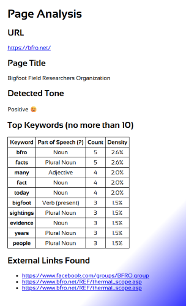
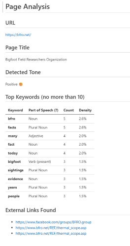

# Simple Page Analyzer

This is a relatively simple Python script that analyzes the content of a web page for the following:

- Captures the page URL and page title.
- Parses the page content.
- Finds the overall content sentiment.
- Finds the top 10 keywords. (For each keyword, shows the part of speech, number of occurrences, and the overall density.)
- Finds all links with fully-formed URLs (internal and external).
- Exports the page analysis in either HTML or Markdown format.

I created the script to demonstrate how a few Python packages can quickly introduce some powerful NLP processing features without a lot of additional coding. (I'm not a great programmer, so if I can do it, then any technically oriented person could do it.)

For example, I used the following packages to get these features:

| Package Name     | Description
|:---              |:---
| `request`        | Request the web page.
| `BeautifulSoup`  | Parsing and extracting HTML content, including named elements like links.
| `TextBlob`       | Analyzing page sentiment and tagging parts of speech (POS).
| `NLTK`           | Natural Language Toolkit (NLTK). Tokenizes text, remove common words from analysis, tag the parts of speech, and calculate the frequency of the keywords.
| `urlparse`       | Request network location from the URL and parses link in the content.

## Run the Page Analyzer Script

1. Install the requirements. (Needed only if you do not have the packages installed.)

   ```
   pip install -r requirements.txt
   ```

2. If this is the first time using the NLTK, you might need to enter the following commands. Otherwise, skip this step.
   ```
   nltk.download('punkt')
   nltk.download('stopwords')
   ```

3. Run the script.
   ```
   python simple_analyzer.py
   ```

4. When prompted, enter a fully-formed HTTP or HTTPS web page address. For example, enter something like the following:
   ```
   https://bfro.net/ 
   ```
   

5. Enter the output format: `html` or `md`.

## Script Output

The script generates a page analysis report in either HTML or Markdown format.

|HTML Example Output | Markdown Example Output
|--|--
| |

The output file name appends a clean version of page title to `page_analysis_` and adds the appropriate file extension. For example, for the https://bfro.net/, the page title is *Bigfoot Field Researchers Organization*. If you opted for markdown format, then the resulting file name would be something like `page_analysis_Bigfoot_Field_Researchers_Organization.md`.

Here are some suggested pages to use for the script:

**Positive Sentiment**

- https://www.intel.com/content/www/us/en/developer/articles/technical/3-ways-to-get-started-with-oneapi-code-samples.html
- https://code.visualstudio.com/docs
- https://bfro.net/
   
**Negative Sentiment**
- https://www.microsoft.com/en-us/windows/business/c/windows-11-pro-intel-vpro


## Clean Up

When you are done, you can remove the installed packages installed for this example by entering the following command:
```
pip uninstall -y -r requirements.txt
```

