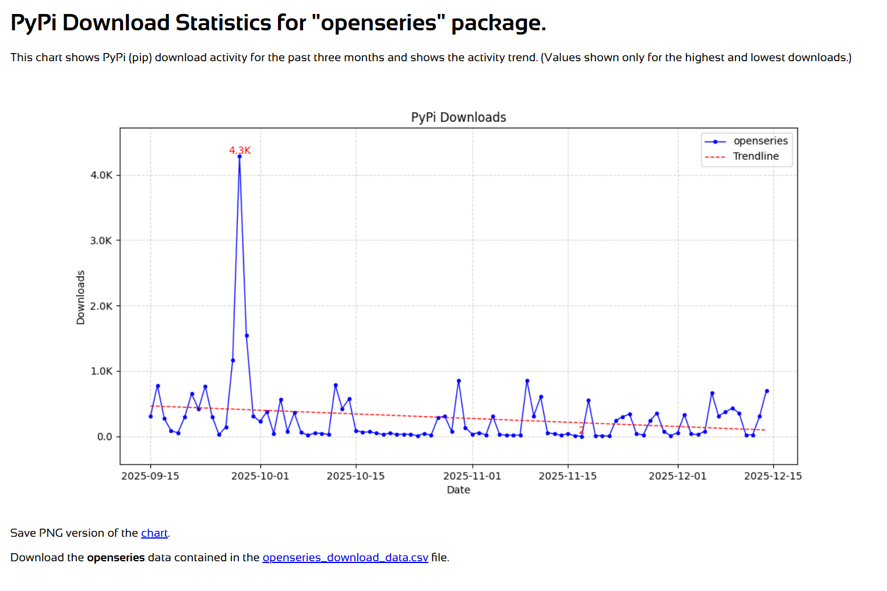

# PyPi Package Data Graph

While I was a data analyst, I created a simple version of this script to help some development teams and product managers, who didn't own the pypi.org packages, visualize pip package usage they helped to maintain. (I know it sounds odd that people building and distributing software packages have no access to usage data, but that's modern corporate life.)

Originally, I just pulled the data into a .csv file, and used Excel to visualize the data for the stakeholders. That approached worked for ad hoc requests, but it was never a great solution.

I wanted to provide a stand-alone solution for future requests, so I've modified my original script to automatically generate a line chart of the data with a linear (best-fit) trendline. (I prefer line charts in these cases because they convey the shape of the data better than other chart types.) The chart includes explicit values for the days with the highest and lowest download numbers.

- [PyPI Stats](https://pypistats.org/api/): Used to retrieve the Pypi (pip) data. (As far as I can tell PyPI Stats is the only way to get the pip data now that other methods are not supported, other than Google BigQuery.) -
- [Matplotlib](https://matplotlib.org/stable/api/_as_gen/matplotlib.pyplot.plot.html#matplotlib.pyplot.plot): Used pyplot.plot to visualize the data in the chart.
- [NumPy](https://numpy.org/doc/2.3/reference/routines.polynomials.poly1d.html): Used polyval and polyfit to generate the trendline.

> **Note**: I started with a mermaid.js xychart version of the chart, but Matplotlib is much easier to implement and format and much clearer to read. I might include a version of the mermaid.jst chart for comparison at some point.

This is a draft of the modified version; however, it's relatively harmless and should not blow up your system in it's current state. It will evolve with some planned improvements as time and energy allow.

## Run the PyPi Package Data Graph Script

1. Install the requirements. (This is necessary only if you do not have the packages installed already.)

   ```
   pip install -r requirements.txt
   ```

2. Run the script.
   ```
   python pypi_downloads.py
   ```

3. When prompted, enter a valid package name (without version numbers). For example, you might enter something like:
   ```
   openseries
   ```
4. Once the script completes, open the HTML file, in the same directory as the script, to see the charted data. You should see something similar to the following image.



## Script Output

The script generates an HTML page containing a PNG image and a CSV file containing the raw data.


The script prepends the package name to the output file name specified in the file. So if you entered "openseries" as the package name, the script will show the following messages once the outputs are generated.

```
Full data saved to openseries_download_data.csv.
HTML container saved to openseries_download_data.html.
```

Here are some suggested packages to use for testing:

- `matplotlib` - Relatively large activity
- `breathe` - Moderate activity
- `openseries` - Relatively light activity


## Clean Up

When you are done, you can remove the packages installed for this example by entering the following command:
```
pip uninstall -y -r requirements.txt
```
Enjoy!